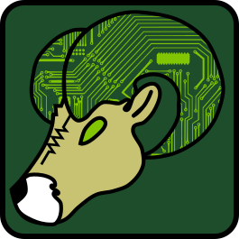

.. Outreach-Workshop-Documentation documentation master file, created by
   sphinx-quickstart on Mon Oct 20 14:05:46 2025.
   You can adapt this file completely to your liking, but it should at least
   contain the root `toctree` directive.

Welcome to ECE Outreach's Workshop Documentation!
===========================================================

Below you can find a list of workshops, demonstrations, tutorials, and additional resources provided by ECE Outreach at CSU!

.. toctree::
   :maxdepth: 1
   :caption: Workshops

   minibots
   ultrasonic_sensor_workshop
   masks

.. toctree::
   :maxdepth: 1
   :caption: Demonstrations

   lled

.. toctree::
   :maxdepth: 1
   :caption: Tutorials

   soldering

.. toctree::
   :maxdepth: 1
   :caption: Additional Resources
   
   modifying