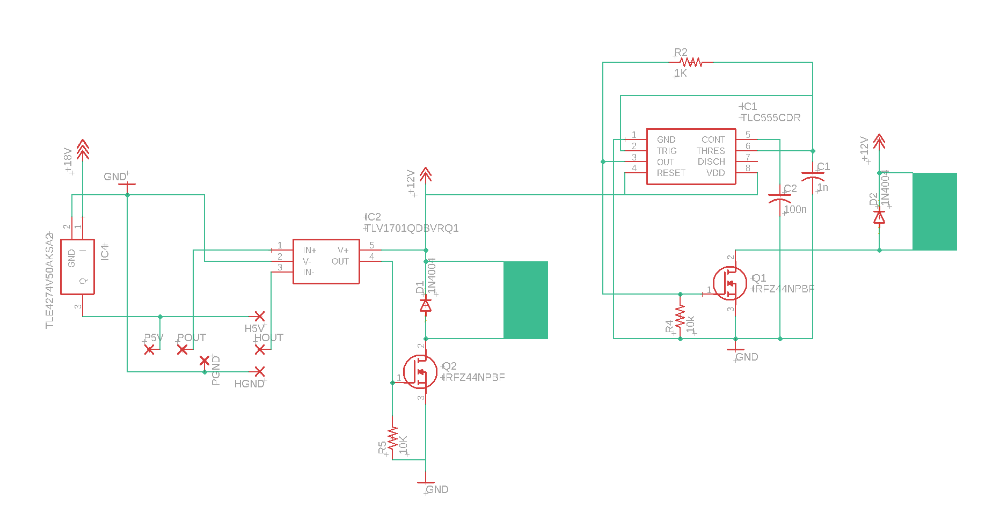
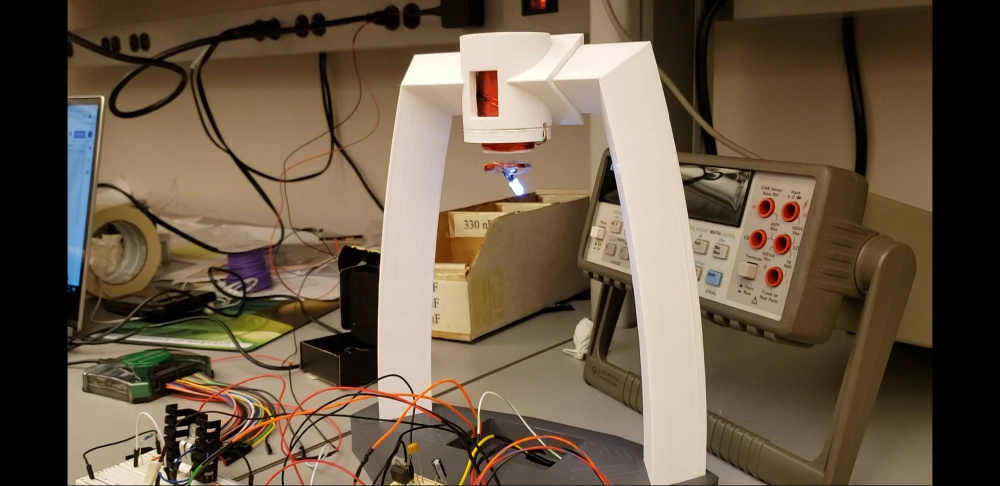

Levitating LED
=================

What is the Levitating LED
---------------------------

The Levitating LED (LLED) was a 202 project Cole and Ryan made in 2019.
It uses an electromagnet to levitate an LED attached to a permanent
magnet. The electromagnet is controlled by the output of a Hall Effect
sensor being compared to a variable voltage. When the LED drops too low,
the electromagnet turns on. When it is sucked up too high, it is turned
off. The LED is powered by an air-core transformer.

Problems with the old version

-  Reliability
-  Power consumption
-  Heat
-  EMF noise
-  Electromagnet strength
-  Ease of use
-  Stability

Plan for improvements
----------------------

Proportional electromagnet strength control 
~~~~~~~~~~~~~~~~~~~~~~~~~~~~~~~~~~~~~~~~~~~~~~

Currently the electromagnet is either on or off. This is controlled by
comparing the sensor voltage to an adjustable constant voltage. To
improve the stability of the light, I plan to take the signal from the
sensor and amplify it with an op amp and feed that directly to the gate
of the mosfet. By controlling the gain of the amp with a variable
feedback network, I will be able to control the gain of the system. The
“gain” is a voltage (of the sensor) to a current (through the
electromagnet) gain. This should improve the stability because it will
be continuously varying the strength of the electromagnet instead of
just turning it on and off. This solution was suggested by an EIR last
year. The added proportional control could be more sensitive to noise,
so we would need to add a low pass filter to the sensor output.

Heat and efficiency
~~~~~~~~~~~~~~~~~~~~~

Currently we are using a 19V laptop charger as the power supply and
voltage regulators to down convert it to 12V and 5V. I want to use a
switch-mode power supply to convert the 19V. A boost converter will work
well for this application. This will greatly reduce power consumption
and heat output. To make the wireless power transfer more efficient we
could make the secondary side resonate by adding a small capacitor and
tuning the frequency till we hit the resonant frequency of the LC
circuit.

Strength
~~~~~~~~~~~~~

To make the electromagnet stronger, I would like to run a higher voltage
than 12V and increase the number of turns. This would involve a partial
redesign of the structure and rebuilding the electromagnet. This should
allow us to levitate the LED lower and use multiple LEDs. This will make
it look much more impressive.

