**Onshape Tutorial**
====================

**Introduction**
----------------

In this workshop, we will be using Onshape, a cloud-based CAD software.
You can access it at https://www.onshape.com/.

**Creating an Account & and a new Document**
--------------------------------------------

1. Go to https://www.onshape.com/ and click on **“Get Started”.**

2. Create an account (email or Google)

3. Click on **Create** → **Document**.

4. Name your document, and click Create.

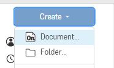

**Set Units:**

- Click the **menu (three lines)** next to your document name

- Go to **Workspace Units**

- Select your desired units

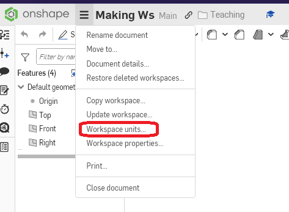

**Basic Controls**
------------------

- **Left-click** → select entity (you will know if it's selected if it's
  highlighted in gold)

- Click a selected entity again or empty space → Deselect

- **Right-click and drag** → Pan Camera

- **Scroll Wheel** → Zoom In/Out

- **Esc →** Exit selected tool

- **CTRL + Z →** Undo

- **CTRL + Y →** Redo

**Starting a Sketch**
---------------------

1. **Right-click** on the plane you want to create your sketch on

   .. image:: images-onshape/image27.png
      :width: 2.83333in
      :height: 2.55962in

2. Click the Sketch button in the toolbar to start sketching. (It is the
   first option furthest to the left.)

   .. image:: images-onshape/image20.png
      :width: 1.19792in
      :height: 0.32292in

**Tip:** Use the plane cube in the top right corner to home your camera
to your desired plane

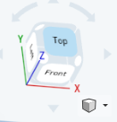

**Sketching**
-------------

When making your sketch, your goal is to create a 2D, fully defined base
for your 3D object. This is done by using Onshape’s sketching tools to
create the lines of your sketch and define them with dimensions and
relations.

**General Step-by-Step for most tools:**
~~~~~~~~~~~~~~~~~~~~~~~~~~~~~~~~~~~~~~~~

Select your tool → right click to set an origin point for the tool→ Drag
to Shape to the desired size→ Click again to confirm an endpoint

**Fully Defining Your Sketch**
------------------------------

A sketch is **fully defined** when all of its lines are **black**
instead of blue.

When a sketch is fully defined, the geometry is fixed and can only be
changed if dimensions or relations are changed or removed.

*Useful Relations*:
~~~~~~~~~~~~~~~~~~~

- Parallel

   .. image:: images-onshape/image16.png
       :width: 0.23148in
       :height: 0.20833in

- Perpendicular

   .. image:: images-onshape/image17.png
       :width: 0.25in
       :height: 0.1875in

- Equal

   .. image:: images-onshape/image19.png
       :width: 0.225in
       :height: 0.20833in

- Horizontal/Vertical

- Midpoint

   .. image:: images-onshape/image23.png
       :width: 0.20833in
       :height: 0.20833in

Useful Sketch Tools
~~~~~~~~~~~~~~~~~~~

- Line Tool

   .. image:: images-onshape/image15.png
       :width: 0.3125in
       :height: 0.20833in

- Ellipse

   .. image:: images-onshape/image14.png
       :width: 0.25794in
       :height: 0.20833in

- Mirror -- need a line to reflect across

   .. image:: images-onshape/image4.png
       :width: 0.22377in
       :height: 0.20833in

Dimensioning
~~~~~~~~~~~~~~~~~~~~~~~

- [D] → toggle dimensioning tool

You can use the dimension tool to set the dimension of a specific entity
or between multiple entities.

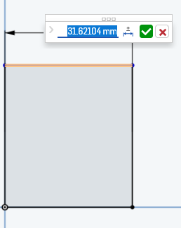

1. Select the entity(s) you want to dimension

2. Left Click to place the dimension label

3. Enter the desired value for the dimension

Note: You can change the value of a set dimension by going back to where
you first defined it and double-clicking the set to the number to change
what's in the textbox.

**For learning purposes, let’s make a cube without using the rectangle
tool.**

Creating a Fully Defined Cube with Relations
--------------------------------------------

Select the line tool and make an enclosed shape with 4 sides that is intentionally asymmetric and weird.
~~~~~~~~~~~~~~~~~~~~~~~~~~~~~~~~~~~~~~~~~~~~~~~~~~~~~~~~~~~~~~~~~~~~~~~~~~~~~~~~~~~~~~~~~~~~~~~~~~~~~~~~

- Start at the origin to make it easier to dimension later.

- You will know if your shape is enclosed by the inside being shaded
  gray.

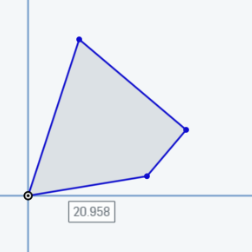

Use relations and dimensions to turn that weird shape into a square.
~~~~~~~~~~~~~~~~~~~~~~~~~~~~~~~~~~~~~~~~~~~~~~~~~~~~~~~~~~~~~~~~~~~~

- To add a **relation**, select all of the entities you want to relate
  and then click on the relation you want to add in the toolbar. For
  example, to make two lines parallel, select the two lines and then
  click on the “Parallel” relation in the toolbar.

- To add a dimension, select the entities you want to dimension and then
  click on the dimension tool in the toolbar. Click again to place the
  dimension and then enter the desired value.

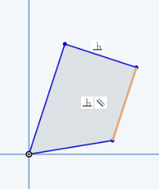

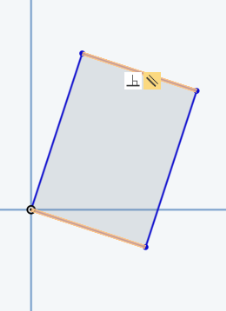

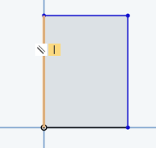

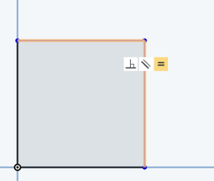

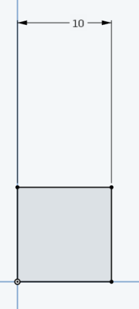

Your sketch is fully defined when all of the lines in your sketch turn
from blue to black. This means that you are unable to move any of the
lines in your sketch without changing the dimensions or relations you
have set.

Your sketch being fully defined is important because it ensures that it
cannot be accidentally modified and fits the specifications you want it
to.

**Once your sketch is fully defined, you can now extrude it
**

- To extrude a shape, make sure that it is fully enclosed.

- Select the shape you want to extrude and then click the extrude tool.
  This will open a menu where you can modify your extrusion settings.

- For a simple extrusion, make sure you have “add” selected and choose
  “blind” for an extrusion with a specific depth. You can also swap the
  direction of your extrusion by clicking the arrow indicating the
  direction of the extrusion.

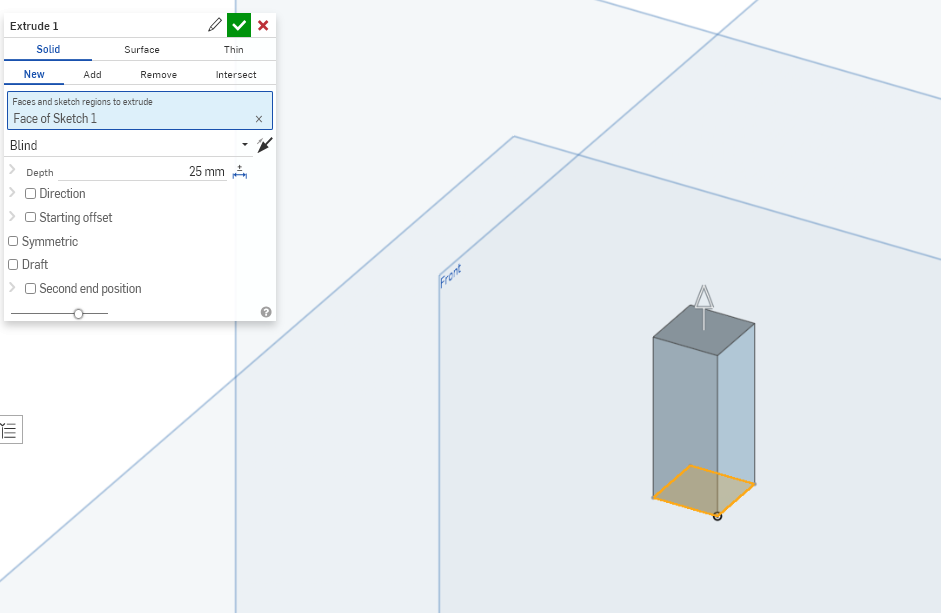

You did it!!!

With the cube that you made, you can now use some of Onshape’s 3D tools
to modify it.

*Notable 3d Tools within Onshape:*

- Fillet - rounds the edge of your cube.

  .. image:: images-onshape/image25.png
   :width: 0.25833in
   :height: 0.20833in

- Chamfer - creates a beveled edge on your cube.

  .. image:: images-onshape/image6.png
   :width: 0.21701in
   :height: 0.20833in

You can also use the sketch tool on any face of your cube to add more
features to it.

Try putting a hole through your cube

   Select the face you want to start the hole from and start a new
   sketch.

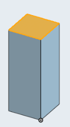

   | To make sure you have a centered hole, make use of some
     construction geometry. These are lines that you designate as
     “imaginary” and use to build other geometry from.
   | We’re going to make two construction lines by making a line that
     goes from the top of the cube to the bottom and making its starting
     point the midpoint of the top edge. To make it a construction line,
     press the “q” key.

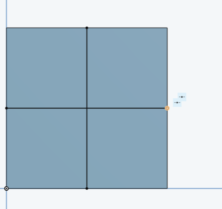

   Now use the circle tool to make the outline of your hole, making the
   center of the circle the midpoint of the construction line you just
   made.

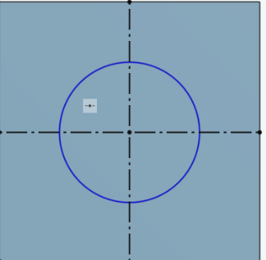

   To make the cut in the cube, select the circle and then click the
   extrude tool. To remove material instead of adding material, select
   “remove” instead of “add” in the extrude menu.

   .. image:: images-onshape/image3.png
      :width: 6.5in
      :height: 6.45833in

   Specify how far through the cube you want the hole to go. If you want
   to make the hole go all the way through, select “through all” instead
   of “blind”.

Congratulations, you made a cube with a hole in it!

If you want to try making something more complicated, here is a part
that is used during the CSWA Certification Exam:

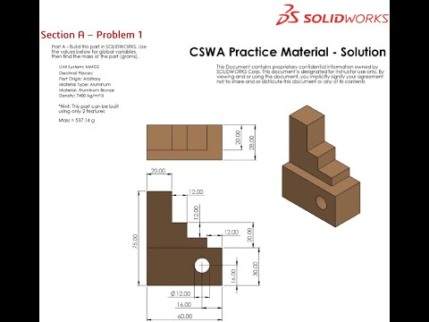

Think before making, try to do as much of the part as you can in as few
steps as possible

Additional (Demonstrate)
------------------------

- Mirror tool

- Using sketches multiple times

- Revolve tool

- Linear patterns

- Assembilies

- Circles

- variables

