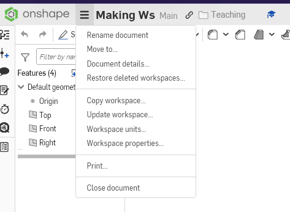
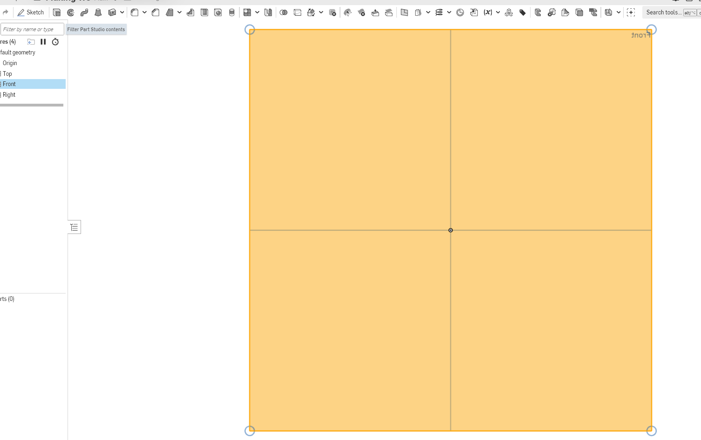

Onshape Tutorial
=================

Introduction
------------
In this workshop, we will be using Onshape, a cloud-based CAD software. You can access it at https://www.onshape.com/.

Creating an Account & and a new Document
----------------------------------------
1. Go to https://www.onshape.com/ and click on **"Get Started".** 
2. Create an an account if you don't already have one. You can create a free account using your email address or with Google. 
3. Click on "Create" then "Document". Give your new document a name and click create.

 
4. Once you've made your document click on the 3 lines button to the left of your document name and go to workspace units to ensure your document is using the correct units.

Basic Controls
--------------

* Left click an entity to select it (you will know if its selected if its highlighted gold)
* Click a selected entity again to deselect it. Or left click empty space to unselect everything.
* Hold down the right mouse button and move the mouse to pan the view.
* Use the scroll wheel to zoom in and out.
* Most tools have some sort of hot key (for example d toggles the dimensioning tool)
* Press esc to deselect a selected tool

Starting a Sketch
-----------------
1. Right click on the plane you want to create your sketch on

.. note::
    You can click on the box with the planes labeled to reorient your view to look directly at the plane you want to sketch on.

2. Click the Sketch button in the toolbar to start sketching. (It is the first option furthest to the left.)

.. figure:: images-onshape/sketch.png
    :alt: Sketch button in Onshape
    :align: center

Sketching
---------
When making your sketch, your goal is to create a 2D fully defined base for your 3D object. This is done by using Onshape's sketching tools to create the lines of your sketch and define them with dimensions and relations.

Using most of the sketching tools in Onshape involves selecting the tool you want to use, selecting the point on your sketch plane where you want your starting point to be, dragging your mouse to modify the shape or size of the entity you are creating, and then clicking again to set the end point of the entity.

Fully Defining Your Sketch
--------------------------

Useful Relations:
    -Parallel
    -Equal
    -Horizontal and Vertical
    -Midpoint 

You can use the dimension tool to set any dimension within your sketch.

.. figure:: images-onshape/dimension.png
    :alt: Dimension tool in Onshape
    :align: center

For learning purposes, let's make a cube without using the rectangle tool.

1. Select the line tool and make an enclosed shape with 4 sides that is intentionally asymmetric and weird.

    * Start at the origin to make it easier to dimension later.
    * You will know if your shape is enclosed if the inside of the shape is shaded gray.

2. Use relations and dimensions to turn that weird shape into a square.

   * To add a relation, select all of the entities you want to relate and then click on the relation you want to add in the toolbar. For example, to make two lines parallel, select the two lines and then click on the "Parallel" relation in the toolbar.
   * To add a dimension, select the entities you want to dimension and then click on the dimension tool in the toolbar. Click again to place the dimension and then enter the desired value.

Your sketch is fully defined when all of the lines in your sketch turn from blue to black. This means that you are unable to move any of the lines in your sketch without changing the dimensions or relations you have set.

Your sketch being fully defined is important because it ensures that it cannot be accidentally modified and fits the specifications you want it to.

1. Once your sketch is fully defined, you can now extrude it

   * To extrude a shape, make sure that it is fully enclosed.
   * Select the shape you want to extrude and then click the extrude tool. This will open a menu where you can modify the settings of your extrusion.
   * For a simple extrusion, make sure you have "add" selected and choose "blind" for an extrusion with a specific depth. You can also swap the direction of your extrusion by clicking the arrow indicating the direction of the extrusion.

You did it!!!

With the cube that you made, you can now use some of Onshape's 3D tools to modify it.

* Fillet - rounds the edge of your cube.
* Chamfer - creates a beveled edge on your cube.
* Shell - hollows out your cube and creates a wall thickness that you can specify.

.. figure:: images-onshape/fillet-chamfer-shell.png
    :alt: Fillet, Chamfer, and Shell tools in Onshape
    :align: center

You can also use the sketch tool on any face of your cube to add more features to it.

Try putting a hole through your cube

1. Select the face you want to start the hole from and start a new sketch.
2. To make sure you have a centered hole, make use of some construction geometry. These are lines that you designate as "imaginary" and use to build other geometry from.

   We're going to make two construction lines by making a line that goes from the top of the cube to the bottom and making its starting point the midpoint of the top edge. To make it a construction line, press the "i" key.

3. Now use the circle tool to make the outline of your hole, making the center of the circle the midpoint of the construction line you just made.
4. To make the cut in the cube, select the circle and then click the extrude tool. To remove material instead of adding material, select "remove" instead of "add" in the extrude menu.
5. Specify how far through the cube you want the hole to go. If you want to make the hole go all the way through, select "through all" instead of "blind".

Congratulations, you made a cube with a hole in it!

If you want to try making something more complicated, here is a part that is used during the workshop.