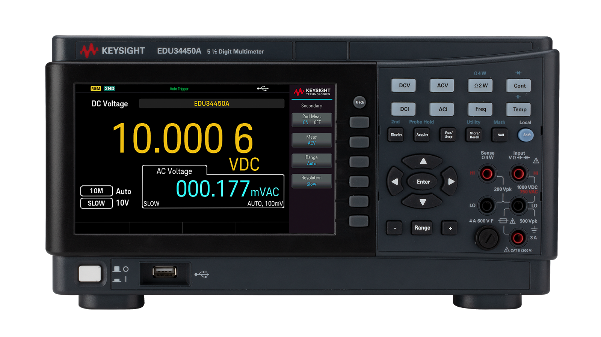
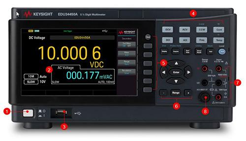
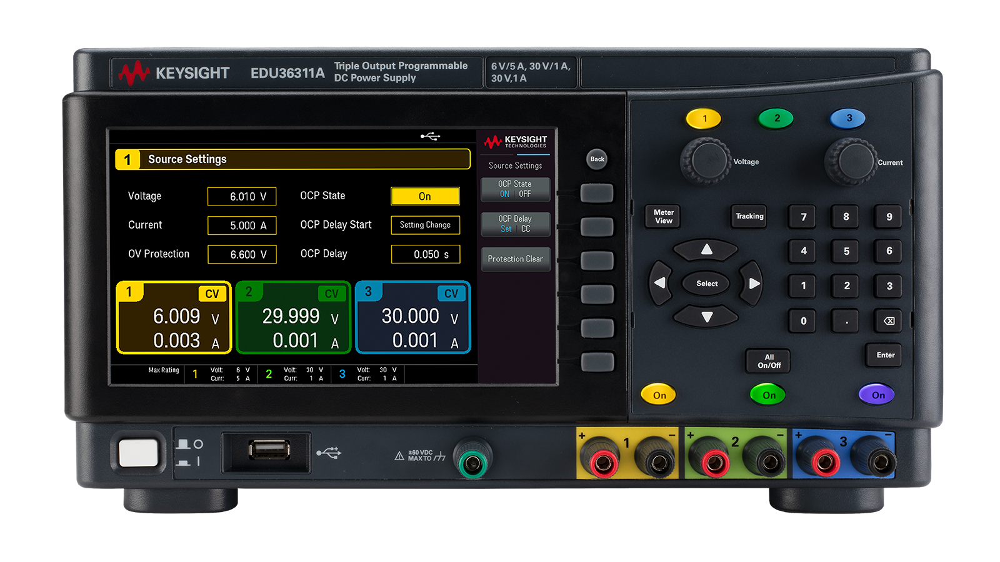
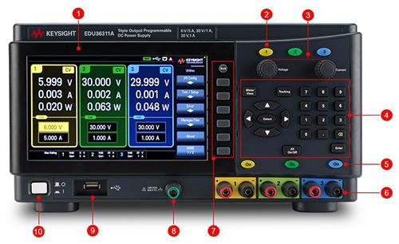
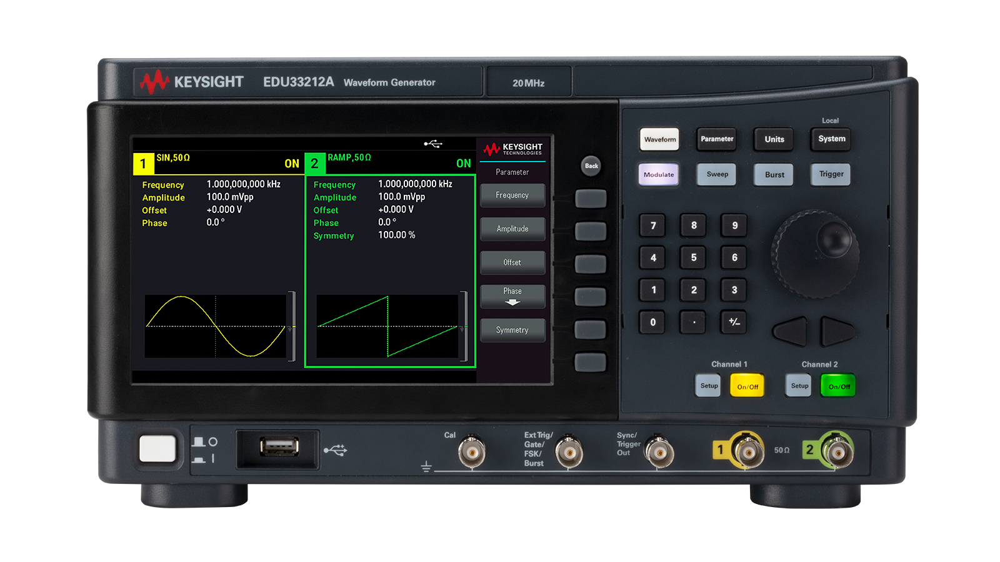
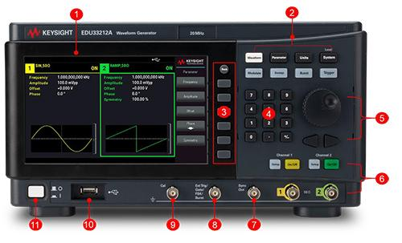

**Keysight EDU34450A**
----------------------

The Keysight EDU34450A is a bench digital multimeter (DMM) model from
**Keysight Technologies**, designed for education labs, training
environments, and general-purpose electronics measurements. It combines
relatively high-resolution measurements with a user-friendly interface,
making it suitable for both learning and routine bench work.

**Key facts**
~~~~~~~~~~~~~

- **Type:** Bench digital multimeter

- **Resolution:** Up to 5½ digits (EDU series)

- **Primary use:** Education, training labs, and general electronics
  testing

- **Vendor:** Keysight Technologies (test and measurement)

- **Typical measurements:** Voltage, current, resistance, frequency,
  continuity, diode test

**Design and features**
~~~~~~~~~~~~~~~~~~~~~~~

The EDU34450A is built as a benchtop instrument with a clear display,
front-panel input terminals, and dedicated buttons for common functions.
It typically offers multiple measurement functions—DC/AC voltage, DC/AC,
2- and 4-wire resistance, frequency/period, continuity, and diode
testing. The front panel layout is optimized for students and engineers
who need to locate controls quickly without a steep learning curve.

**Resolution and performance**
~~~~~~~~~~~~~~~~~~~~~~~~~~~~~~

As part of Keysight’s EDU line, this model focuses on offering up to 5
½-digit resolution alongside stable basic accuracy, rather than pushing
the extreme precision of higher-end metrology meters. This makes it
well-suited for most electronics lab experiments, troubleshooting tasks,
and instructional demonstrations where a balance of performance and cost
is important.

**Connectivity and lab integration**
~~~~~~~~~~~~~~~~~~~~~~~~~~~~~~~~~~~~

The EDU34450A typically supports modern connectivity options such as USB
(and, for some variants, LAN), enabling remote control, automated
measurements, and data logging via PC. This integration capability is
particularly useful in teaching laboratories, where instructors may set
up automated experiments or collect data from multiple instruments
simultaneously for analysis and reporting.

**Quick Start: Basic Measurements**
~~~~~~~~~~~~~~~~~~~~~~~~~~~~~~~~~~~

+-----------------------------------+-----------------------------------+
| **Label**                         | **Description**                   |
+-----------------------------------+-----------------------------------+
| **:mark:`(1)`**                   | On/Off Switch                     |
+-----------------------------------+-----------------------------------+
| **:mark:`(2)`**                   | Display                           |
+-----------------------------------+-----------------------------------+
| **:mark:`(3)`**                   | USB Host                          |
+-----------------------------------+-----------------------------------+
| **:mark:`(4)`**                   | Measurement Function Keys         |
+-----------------------------------+-----------------------------------+
| **:mark:`(5)`**                   | Soft Keys                         |
+-----------------------------------+-----------------------------------+
| **:mark:`(6)`**                   | Range Change Keys                 |
+-----------------------------------+-----------------------------------+
| **:mark:`(7)`**                   | Input Terminals                   |
+-----------------------------------+-----------------------------------+
| **:mark:`(8)`**                   | Fuse                              |
+-----------------------------------+-----------------------------------+

**Power & Setup**
~~~~~~~~~~~~~~~~~

1. Plug in the meter

2. Press **Power Switch :mark:`(1)`**

3. Insert leads **:mark:`(7)`**:

   - **Black → COM**

   - **Red → VΩ** (voltage, resistance, diode, continuity)

   - **Red → A / mA** (current)

**Measure DC Voltage (DCV)**
~~~~~~~~~~~~~~~~~~~~~~~~~~~~

1. Press the **DCV button** **:mark:`(4)`** to measure **DC Voltage**

2. Connect probes **in parallel** with the circuit

3. Read value on display **:mark:`(2)`**

✔ Used for batteries, power rails, bias voltages

**Measure AC Voltage (ACV)**
~~~~~~~~~~~~~~~~~~~~~~~~~~~~

1. Press the **ACV button** **:mark:`(4)`** to measure **AC Voltage**

2. Connect probes **in parallel**

3. Read the RMS voltage

✔ Used for signal amplitudes (low-frequency AC)

**Measure DC Current (DCI)**
~~~~~~~~~~~~~~~~~~~~~~~~~~~~

1. Move **red lead to A or mA**

2. Press the **DCI button** **:mark:`(4)`** to measure **DC.**

3. **Break the circuit** and insert the meter **in series**

4. Read current

⚠️ Never place a meter across a voltage source in current mode

**Measure AC Current (ACI)**
~~~~~~~~~~~~~~~~~~~~~~~~~~~~

1. Red lead → **A / mA**

2. Press the **ACI button** **:mark:`(4)`** to measure **AC**.

3. Measure **in series**

**Measure Resistance**
~~~~~~~~~~~~~~~~~~~~~~

1. **Turn circuit power OFF**

2. Press the **Ω2W button** **:mark:`(4)`** to measure resistance.

   a. Press the **Shift Button** **:mark:`(4)`** then the **Ω2W button**
      **:mark:`(4)`** to select the **Ω4W mode**

3. Measure across the component

✔ Used for resistor verification

**Continuity Test**
~~~~~~~~~~~~~~~~~~~

1. Press the **Cont. button :mark:`(4)`** to check for continuity.

2. Touch probes across the connection

3. **Beep = electrical connection**

✔ Used for wiring checks and shorts

**Diode Test**
~~~~~~~~~~~~~~

1. Press the **Shift Button** **:mark:`(4)`** then the **Cont. button**
   **:mark:`(4)`** to select the diode test mode.

2. **Red** **→** **anode**, **Black** **→** **cathode**

3. Forward voltage appears (~0.6–0.7 V for silicon)

✔ Reverse direction should read OL or no conduction

**Keysight EDU36311A**
----------------------

The **Keysight EDU36311A** is a programmable triple-output DC power
supply produced by **Keysight Technologies**. It forms part of the
company’s **Smart Bench Essentials** series, which integrates multiple
laboratory instruments with remote connectivity and data analysis via
PathWave BenchVue software. It is designed for educational, engineering,
and R&D test environments that require clean, reliable power delivery.

.. _key-facts-1:

**Key facts**
~~~~~~~~~~~~~

- **Outputs:** 3 independent (0–6 V / 5 A and 2 × 0–30 V / 1 A)

- **Total power:** 90 W

- **Display:** 7-inch color LCD

- **Connectivity:** USB 2.0 and LAN (LXI Core)

- **Ripple & noise:** ≤ 1 mVrms / ≤ 5 mVpp

.. _design-and-features-1:

**Design and features**
~~~~~~~~~~~~~~~~~~~~~~~

The EDU36311A provides three isolated, independently controlled channels
that can be configured in series, parallel, or ± voltage combinations. A
sequencing function allows timed activation or deactivation of outputs,
useful for powering logic before higher-power circuits. Its 7-inch color
screen offers simultaneous monitoring of all outputs, and front-panel
knobs allow fine voltage and current adjustments. The supply maintains
low acoustic noise through intelligent fan control.

**Performance and protection**
~~~~~~~~~~~~~~~~~~~~~~~~~~~~~~

Built for accuracy and stability, the unit achieves programming and
readback precision of about 0.05% + 10 mV. Ripple and noise levels below
1 mVrms deliver exceptionally clean output for sensitive electronics. It
includes comprehensive protection: over-voltage (OVP), over-current
(OCP), over-temperature (OTP), and short-circuit safeguards. This
robustness makes it suitable for continuous operation in academic and
industrial labs.

**Software integration**
~~~~~~~~~~~~~~~~~~~~~~~~

Through **Keysight PathWave BenchVue**, users can remotely set
parameters, log data, and visualize current-voltage trends without
coding. The software supports cloud connectivity and data export to
tools such as MATLAB, Excel, and Word, enabling collaborative analysis
and report generation.

**Use and positioning**
~~~~~~~~~~~~~~~~~~~~~~~

As part of the Smart Bench Essentials ecosystem—alongside a digital
multimeter, oscilloscope, and function generator—the EDU36311A helps
modernize teaching and testing setups. Its combination of precision,
usability, and integration makes it a dependable power source for
prototyping, electronics instruction, and device verification.

**Quick Start: Powering a Circuit**
~~~~~~~~~~~~~~~~~~~~~~~~~~~~~~~~~~~

+-----------------------------------+-----------------------------------+
| **Label**                         | **Description**                   |
+-----------------------------------+-----------------------------------+
| **:mark:`(1)`**                   | 7-inch WVGA display               |
+-----------------------------------+-----------------------------------+
| **:mark:`(2)`**                   | Output selection keys             |
+-----------------------------------+-----------------------------------+
| **:mark:`(3)`**                   | Voltage/current knobs             |
+-----------------------------------+-----------------------------------+
| **:mark:`(4)`**                   | Function/navigation/numeric keys  |
+-----------------------------------+-----------------------------------+
| **:mark:`(5)`**                   | Output on/off keys                |
+-----------------------------------+-----------------------------------+
| **:mark:`(6)`**                   | Output terminals                  |
+-----------------------------------+-----------------------------------+
| **:mark:`(7)`**                   | Soft keys                         |
+-----------------------------------+-----------------------------------+
| **:mark:`(8)`**                   | Earth ground reference            |
+-----------------------------------+-----------------------------------+
| **:mark:`(9)`**                   | USB port                          |
+-----------------------------------+-----------------------------------+
| **:mark:`(10)`**                  | Power                             |
+-----------------------------------+-----------------------------------+

**Power & Safety**
~~~~~~~~~~~~~~~~~~

1. Press the **I/O Button :mark:`(10)`** to **Power ON**

2. Ensure **Outputs OFF :mark:`(4)` All On/Off if the outputs are off;
   ignore this step**

3. Set the voltage **before connecting**

**Single Supply (e.g., 6 V/5 A or 30 V/1 A)**
~~~~~~~~~~~~~~~~~~~~~~~~~~~~~~~~~~~~~~~~~~~~~

1. Select **CH1 :mark:`(2)` :mark:`(1)`**

2. Set **Voltage**

   - You can use the dial **:mark:`(3)`** or just input the value
     directly with the number pad **:mark:`(4)`**

3. Set **Current Limit** (important!)

4. Connect:

   - Red → V+

   - Black → GND

5. Press **Output ON :mark:`(On)`**

**Dual Supply (± for Op-Amps)**
~~~~~~~~~~~~~~~~~~~~~~~~~~~~~~~

1. CH1 → +V **:mark:`(2)` :mark:`(1)`**

2. CH2 → −V **:mark:`(2)` :mark:`(2) `**

3. Tie the **grounds together :mark:`(8)`**

4. Verify voltages before connecting the circuit

✔ Common examples: ±12 V, ±15 V

**Turning Off**
~~~~~~~~~~~~~~~

1. Press **Output OFF :mark:`(5)` (All On/Off)**

2. Then rewire or disconnect

⚠️ Never hot-swap sensitive circuits without current limiting

**Keysight EDU33212A**

The Keysight EDU33212A is a dual-channel, 20 MHz function and arbitrary
waveform generator from the Keysight Technologies Smart Bench Essentials
Series. Designed for education, research, and entry-level professional
labs, it offers precise, low-distortion signal generation with extensive
waveform and modulation options.

.. _key-facts-2:

**Key facts**
~~~~~~~~~~~~~

- **Bandwidth:** 20 MHz (optional 25 MHz upgrade)

- **Channels:** 2 independent, synchronized

- **Vertical resolution:** 16 bit @ 250 MSa/s

- **Display:** 7-inch color LCD with graphical editing

- **Interfaces:** USB (host & device) and LAN I/O

- **Software:** PathWave BenchVue included

.. _design-and-features-2:

**Design and features**
~~~~~~~~~~~~~~~~~~~~~~~

The EDU33212A provides up to 8 million samples per channel and supports
standard waveforms—sine, square, ramp, pulse, triangle, Gaussian noise,
and DC—as well as user-defined arbitrary waveforms. Six built-in
modulation types (AM, FM, PM, PWM, FSK, BPSK) allow signal shaping for
communications and control applications. A bright 7-inch display enables
simultaneous waveform visualization and parameter editing.

**Connectivity and control**
~~~~~~~~~~~~~~~~~~~~~~~~~~~~

With USB and LAN I/O interfaces, the generator integrates easily into
automated test setups. The included PathWave BenchVue software provides
remote control, data logging, and waveform design from a PC without
programming. External triggering and synchronization between channels
facilitate complex signal sequencing and phase-coherent outputs.

**Applications and significance**
~~~~~~~~~~~~~~~~~~~~~~~~~~~~~~~~~

Aimed at education and general-purpose testing, the EDU33212A combines
professional-grade precision with intuitive operation. Its role in the
Smart Bench Essentials ecosystem makes it suitable for coordinated use
with Keysight power supplies, digital multimeters, and oscilloscopes,
supporting modern teaching labs and entry-level R&D environments.

**Quick Start: Signal Generation**
~~~~~~~~~~~~~~~~~~~~~~~~~~~~~~~~~~

+-----------------------------------+-----------------------------------+
| **Label**                         | **Description**                   |
+-----------------------------------+-----------------------------------+
| **:mark:`(1)`**                   | Display                           |
+-----------------------------------+-----------------------------------+
| **:mark:`(2)`**                   | Function keys                     |
+-----------------------------------+-----------------------------------+
| **:mark:`(3)`**                   | Soft keys                         |
+-----------------------------------+-----------------------------------+
| **:mark:`(4)`**                   | Numeric keys                      |
+-----------------------------------+-----------------------------------+
| **:mark:`(5)`**                   | Knob and cursor arrows            |
+-----------------------------------+-----------------------------------+
| **:mark:`(6)`**                   | Output connectors, setup, and     |
|                                   | On/Off buttons                    |
+-----------------------------------+-----------------------------------+
| **:mark:`(7)`**                   | Sync/trigger output connector     |
+-----------------------------------+-----------------------------------+
| **:mark:`(8)`**                   | External Trig/Gate/FSK/Burst      |
|                                   | connector                         |
+-----------------------------------+-----------------------------------+
| **:mark:`(9)`**                   | CAL connector                     |
+-----------------------------------+-----------------------------------+
| **:mark:`(10)`**                  | USB host                          |
+-----------------------------------+-----------------------------------+
| **:mark:`(11)`**                  | Power switch                      |
+-----------------------------------+-----------------------------------+

**Power & Output**
~~~~~~~~~~~~~~~~~~

1. Plug in → **Power ON :mark:`(11)`**

2. Connect the **BNC output → circuit input:mark:`(6)`**

3. Connect **ground**

**Generate a Sine Wave**
~~~~~~~~~~~~~~~~~~~~~~~~

1. Select **Sine**

   a. By default, the device should start on **Waveform :mark:`CH 1`.**
      Otherwise, press the **Waveform** button to select a waveform.

   b. Use the appropriate **Soft key :mark:`(3)`** to select **Sine**

   c. Press the **Waveform** **:mark:`(2)`**\ to toggle between
      **:mark:`CH1`** and **:mark:`CH2`**

2. Set **Frequency** (e.g., 1 kHz)

   a. By default, the device should select **Parameter** **:mark:`(2)`**
      once you have selected a waveform in the previous step. Otherwise,
      press the **Parameter** **:mark:`(2)`** button to set a
      **Frequency**.

   b. Use the appropriate **Soft key :mark:`(3)`** to select
      **Frequncy**.

   c. Use the **Numeric keys :mark:`(4)`** to input your desired
      frequency.

      i. Select your desired SI prefix (μHz, mHz, Hz, kHz, MHz)

3. Set **Amplitude** (e.g., 1 Vpp)

   a. By default, the device should still be in **Parameter**
      **:mark:`(2)`.**\ Otherwise, press the **Parameter**
      **:mark:`(2)`** button to set an **Amplitude**.

   b. Use the appropriate **Soft key :mark:`(3)`** to select an
      **Amplitude**

      i. mVpp, Vpp, mVrms, Vrms, dBm

4. Set **Offset = 0 V**

   a. By default, the device should still be in **Parameter**
      **:mark:`(2)`.**\ Otherwise, press the **Parameter**
      **:mark:`(2)`** button to set an **Offset**.

   b. Use the appropriate **Soft key :mark:`(3)`** to select **Offset**.

   c. Use the **Numeric keys :mark:`(4)`** to input your desired Offset.

      i. Select your desire SI prefix

5. Turn **Output ON :mark:`(6)`**

   a. Use the appropriate **On/Off :mark:`(6)`** button for your desired
      channel.

      i. **:mark:`CH1`**, **:mark:`CH2`**

✔ Most common input for analog labs

**Square or Triangle Wave**
~~~~~~~~~~~~~~~~~~~~~~~~~~~

1. Select the **Waveform :mark:`(2)`** button to select a different type
   of waveform

   a. Use the appropriate **Soft key :mark:`(3)`** to select your
      desired Waveform

      i. Square, Ramp, Pulse

         1. To make a **Triangular Wave**, select the **Ramp function**
            and adjust the symmetry to **50%**

2. Adjust frequency & amplitude to your desired values

3. Verify the output on an oscilloscope

4. Turn off outputs before connecting the waveform generator to your
   circuit.

**Important Notes**
~~~~~~~~~~~~~~~~~~~

⚠️ Amplitude is **peak-to-peak (Vpp)**

⚠️ Offset adds DC bias to the signal

✔ Always check the output with a scope first

